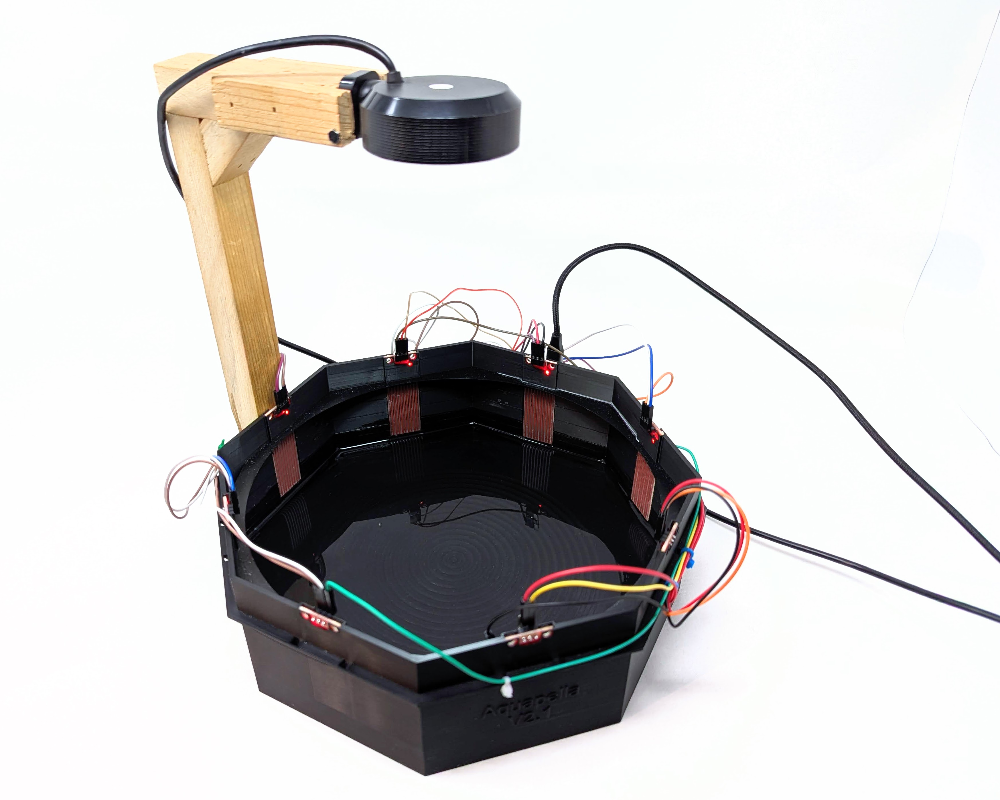

# aquapella
This repository contains all of the files used in creating the Aquapella gesutral water instrument

## Materials
- 8 [water level sensors](https://www.amazon.com/WWZMDiB-12PCS-Water-Sensor-Detection/dp/B0BVH1J9J7)
- 1 [arduino pro micro](https://www.amazon.com/Teyleten-Robot-Atmega32U4-Development-Microcontroller/dp/B0B6HYLC44)
- 1 [arduino nano screw terminal adaptor](https://www.amazon.com/HiLetgo-Controller-Expansion-Extension-ATMEGA328P/dp/B073JGV87F)
  - Pin names do not line up with the pro micro but it works and makes wiring much easier
- 24 [Male to Female header wires](https://www.amazon.com/EDGELEC-Breadboard-Optional-Assorted-Multicolored/dp/B07GD2PGY4)
  - I would recommend having a variety of sizes but having some that are at least a foot long
- Camera {August needs to insert link to USB camera}
- 3D Printed Housing

### Container
The housing was printed with bambu basic PLA black on a Bambu Lab X-1 Carbon.
The print was done on a bambu textured plate with a 0.4mm nozle with a layer height of 0.08mm
Increasing wall loops and decreasing layer height / nozzle thickness will make the container more robust and water proof

PLA is not water proof by any means, but after extensive testing the Aquapella container never warped, leaked, or was damaged by water when printed with these settings. However, I would also recommend not keeping water in the aquapella for a long period of time in order to reduce possible damage to the instrument.

### Sensors
These sensors are small and extremely affortable. It is recommended to actually coat these sensors in [silicone lubricant](https://www.amazon.com/WD-40-Specialist-Resistant-Lubricant-STRAW-SPRAYS/dp/B00631GSSI) frequently in order to decrease water that will stick to the sensor and it will help the sensors last longer. While the silicone does not fully eliminate water sticking or the eroding effects of eletrolosis, it will help mitigate these negative effects greatly.
